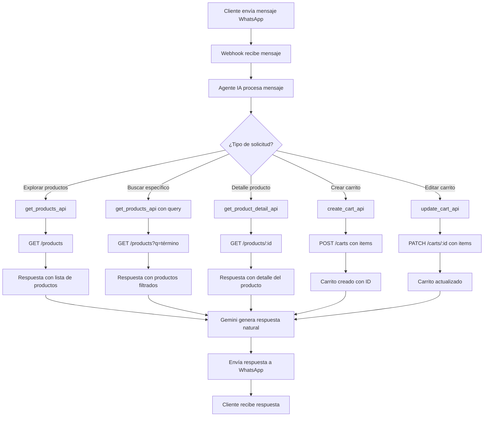

# Desafío Técnico Laburen.com - Documentación Conceptual

## 1. Arquitectura de Alto Nivel

### Componentes Principales

```
┌─────────────────┐    ┌─────────────────┐    ┌─────────────────┐
│   WhatsApp API  │    │   Agente de IA  │    │   API REST      │
│                 │    │   (Gemini +     │    │   (FastAPI)     │
│  - Recibe msgs  │◄──►│    Fallback)    │◄──►│                 │
│  - Envía resp.  │    │                 │    │  - GET products │
└─────────────────┘    └─────────────────┘    │  - POST carts   │
                                               │  - PATCH carts  │
                                               └─────────────────┘
                                                       ↓
                                               ┌─────────────────┐
                                               │   Base de Datos │
                                               │   (SQLite)      │
                                               │                 │
                                               │  - products     │
                                               │  - carts        │
                                               │  - cart_items   │
                                               └─────────────────┘
```

### Stack Tecnológico

- **Backend**: FastAPI (Python 3.13+)
- **Base de Datos**: SQLite (desarrollo) / PostgreSQL (producción)
- **IA**: Google Gemini 1.5-flash con sistema de fallback
- **WhatsApp**: Twilio WhatsApp Sandbox
- **ORM**: SQLAlchemy
- **Datos**: Pandas + OpenPyXL para carga desde Excel

## 2. Diagrama de Flujo de Interacción

### Flujo Principal: Cliente Explora → Crea Carrito → (Opcional) Edita Carrito



## 3. Endpoints de la API

### 3.1 Productos

| Método | Ruta | Descripción | Códigos HTTP |
|--------|------|-------------|--------------|
| **GET** | `/products` | Lista productos con filtro opcional `?q=término` | 200, 500 |
| **GET** | `/products/:id` | Detalle de un producto específico | 200, 404 |

**Ejemplo GET /products:**
```json
[
  {
    "id": 1,
    "name": "Camisa L Azul",
    "description": "Ropa - Camisa casual azul",
    "price": 25.99,
    "stock": 15
  }
]
```

### 3.2 Carritos

| Método | Ruta | Descripción | Códigos HTTP |
|--------|------|-------------|--------------|
| **POST** | `/carts` | Crea carrito. Body: `{items:[{product_id, qty}]}` | 201, 404, 400 |
| **GET** | `/carts/:id` | Obtiene un carrito específico | 200, 404 |
| **PATCH** | `/carts/:id` | Actualiza carrito. Body: `{items:[{product_id, qty}]}` | 200, 404, 400 |

**Ejemplo POST /carts:**
```json
// Request
{
  "items": [
    {"product_id": 1, "qty": 2},
    {"product_id": 15, "qty": 1}
  ]
}

// Response
{
  "id": 1,
  "items": [
    {
      "product_id": 1,
      "name": "Camisa L Azul",
      "price": 25.99,
      "qty": 2
    }
  ],
  "total_amount": 51.98,
  "total_items": 2,
  "created_at": "2025-01-21T..."
}
```

## 4. Esquema de Base de Datos

### Tablas

```sql
-- Productos
CREATE TABLE products (
    id INTEGER PRIMARY KEY AUTOINCREMENT,
    name TEXT NOT NULL,
    description TEXT,
    price REAL NOT NULL,
    stock INTEGER NOT NULL
);

-- Carritos
CREATE TABLE carts (
    id INTEGER PRIMARY KEY AUTOINCREMENT,
    items TEXT NOT NULL,  -- JSON con items del carrito
    total_amount REAL NOT NULL,
    total_items INTEGER NOT NULL,
    created_at TEXT DEFAULT CURRENT_TIMESTAMP
);
```

**Nota**: En esta implementación simplificada, los items del carrito se almacenan como JSON en la tabla `carts`. En producción se recomendaría usar una tabla `cart_items` separada.

## 5. Funcionalidades del Agente IA

### 5.1 Capacidades

✅ **Exploración de Productos**
- Lista catálogo completo
- Búsqueda por términos
- Detalle de productos específicos

✅ **Gestión de Carritos**
- Creación de carritos con múltiples productos
- Actualización de cantidades
- Eliminación de productos (qty = 0)
- Validación de stock automática

✅ **Interacción Natural**
- Procesamiento de lenguaje natural en español
- Respuestas contextuales con emojis
- Manejo de errores amigable

### 5.2 Comandos Soportados

| Comando | Ejemplo | Funcionalidad |
|---------|---------|---------------|
| Saludo | "hola", "buenos días" | Mensaje de bienvenida |
| Ver productos | "productos", "catálogo" | Lista productos disponibles |
| Buscar | "buscar camisa", "busca azul" | Filtra productos por término |
| Comprar | "quiero comprar...", "crear carrito" | Inicia proceso de compra |

## 6. Configuración y Despliegue

### 6.1 Variables de Entorno

```bash
# Requerido - mejora respuestas del agente
GEMINI_API_KEY=tu_gemini_api_key_aqui

# Para despliegue en WhatsApp con Twilio
TWILIO_ACCOUNT_SID=tu_twilio_sid_aqui
TWILIO_AUTH_TOKEN=tu_twilio_token_aqui
TWILIO_WHATSAPP_NUMBER=+1415523xxxx
```

### 6.2 Instalación y Ejecución

```bash
# Instalar dependencias
pip install -r requirements.txt

# Ejecutar servidor
uvicorn main:app --reload --host 0.0.0.0 --port 8000
```

### 6.3 Endpoints de Prueba

- **API Docs**: http://localhost:8000/docs
- **Prueba agente**: http://localhost:8000/test/{mensaje}
- **Health check**: http://localhost:8000/health

---

*Documentación generada para el Desafío Técnico de Laburen.com*
*Fecha: Septiembre 2025*